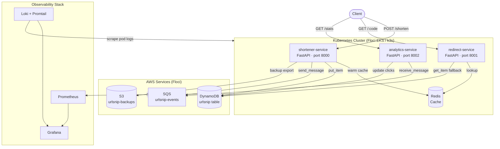
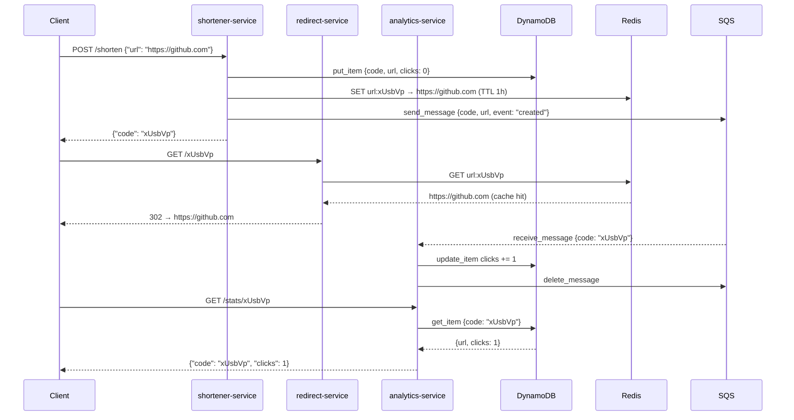
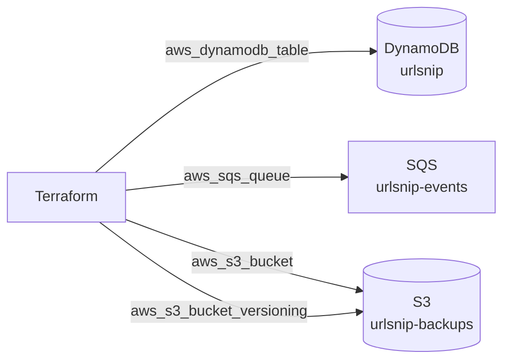
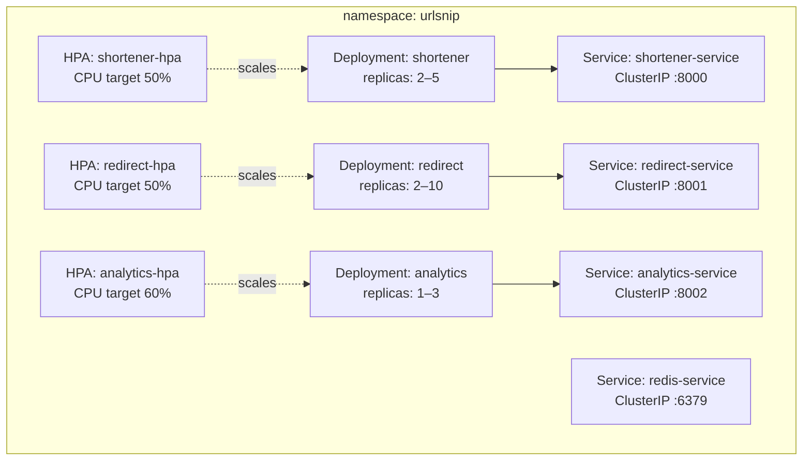
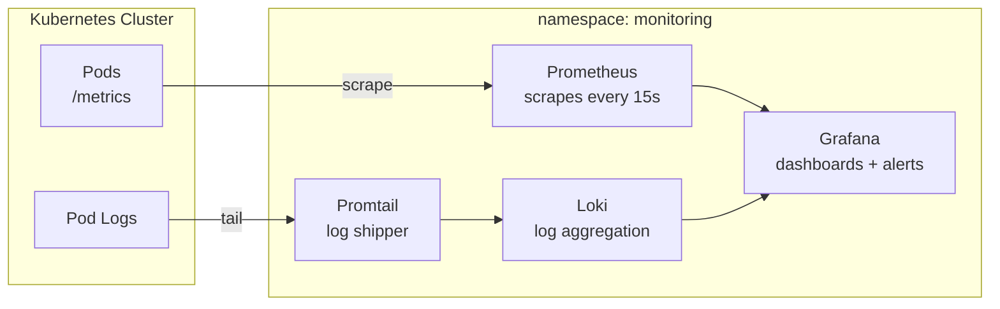

# URLSnip

A production-grade URL shortener built on a microservices architecture, deployed on Kubernetes with full observability — metrics, logs, and alerting included.

Shorten a URL, track redirects in real time, and query analytics — all backed by AWS-native services (DynamoDB, SQS, S3), containerized with Docker, orchestrated with Kubernetes, and monitored with Prometheus, Grafana, and Loki.

---

## Architecture



---

## Services

### shortener-service
Accepts a long URL and returns a short code. Writes the mapping to DynamoDB, warms the Redis cache, and publishes a `created` event to SQS.

**Endpoints**
- `POST /shorten` — `{"url": "https://..."}` → `{"code": "xUsbVp", "short_url": "..."}`
- `GET /links` — list all shortened URLs
- `GET /health` — health check

### redirect-service
Resolves a short code to its original URL and issues a `302` redirect. Checks Redis first for sub-millisecond lookups, falls back to DynamoDB on cache miss.

**Endpoints**
- `GET /:code` — `302 Found` → original URL
- `GET /health` — health check

### analytics-service
Consumes SQS events asynchronously and tracks click counts per code in DynamoDB.

**Endpoints**
- `GET /stats/:code` — `{"code": "xUsbVp", "url": "...", "clicks": 4}`
- `GET /stats` — all codes with click counts
- `GET /health` — health check

---

## Data Flow



---

## Infrastructure

All AWS resources are provisioned via Terraform targeting Floci — a free, open-source local AWS emulator. The same Terraform HCL runs against real AWS with zero changes.



| Resource | Type | Purpose |
|---|---|---|
| `urlsnip` | DynamoDB table | Stores code → URL mappings + click counts |
| `urlsnip-events` | SQS standard queue | Async event bus between shortener and analytics |
| `urlsnip-backups` | S3 bucket (versioned) | Link export backups |

---

## Kubernetes

All services run in the `urlsnip` namespace with readiness/liveness probes, resource limits, and Horizontal Pod Autoscalers.



---

## Observability



| Tool | Role |
|---|---|
| Prometheus | Scrapes `/metrics` from all pods every 15s |
| Grafana | Dashboards for request rate, latency, pod CPU/memory |
| Loki | Centralized log aggregation from all pods |
| Promtail | Ships pod logs to Loki |

---

## Tech Stack

| Layer | Technology |
|---|---|
| Services | Python 3.11, FastAPI, Uvicorn |
| Cache | Redis 7 |
| Database | AWS DynamoDB (via Floci) |
| Queue | AWS SQS (via Floci) |
| Storage | AWS S3 (via Floci) |
| Containers | Docker, Docker Compose |
| Orchestration | Kubernetes (k3s via Floci EKS) |
| IaC | Terraform 1.15+ |
| Monitoring | Prometheus, Grafana, Loki, Promtail |
| Image Baking | Packer (ops toolbox) |
| Local AWS | Floci (free LocalStack alternative) |

---

## Project Structure

```
urlsnip/
├── services/
│   ├── shortener-service/
│   │   ├── app/main.py
│   │   ├── Dockerfile
│   │   └── requirements.txt
│   ├── redirect-service/
│   │   ├── app/main.py
│   │   ├── Dockerfile
│   │   └── requirements.txt
│   └── analytics-service/
│       ├── app/main.py
│       ├── Dockerfile
│       └── requirements.txt
├── docker-compose.yml
├── terraform/
│   ├── main.tf
│   ├── variables.tf
│   ├── outputs.tf
│   ├── dynamodb.tf
│   ├── sqs.tf
│   └── s3.tf
├── k8s/
│   ├── namespace.yaml
│   ├── configmap.yaml
│   ├── shortener/
│   │   ├── deployment.yaml
│   │   ├── service.yaml
│   │   └── hpa.yaml
│   ├── redirect/
│   │   ├── deployment.yaml
│   │   ├── service.yaml
│   │   └── hpa.yaml
│   └── analytics/
│       ├── deployment.yaml
│       ├── service.yaml
│       └── hpa.yaml
├── monitoring/
│   ├── prometheus/values.yaml
│   ├── grafana/values.yaml
│   └── loki/values.yaml
└── packer/
    └── ops-toolbox.pkr.hcl
```

---

## Running Locally

### Prerequisites

- Docker Desktop
- Terraform
- kubectl
- Helm
- Floci CLI
- AWS CLI

### Start

```bash
# Set AWS env (Floci uses dummy creds)
export AWS_ACCESS_KEY_ID=test
export AWS_SECRET_ACCESS_KEY=test
export AWS_DEFAULT_REGION=us-east-1
export KUBECONFIG=~/.kube/urlsnip-local

# Start Floci (local AWS)
docker-compose up floci -d

# Provision AWS resources
cd terraform && terraform apply -auto-approve && cd ..

# Build and run services locally
docker-compose up --build

# Or deploy to Kubernetes
docker-compose up floci -d
# load images into k3s then:
kubectl apply -f k8s/
```

### Test

```bash
# Shorten a URL
curl -X POST http://localhost:8000/shorten \
  -H "Content-Type: application/json" \
  -d '{"url": "https://github.com"}'

# Redirect
curl -v http://localhost:8001/<code>

# Analytics
curl http://localhost:8002/stats/<code>
```

---

## Terraform Commands

```bash
cd terraform
terraform init       # initialise providers
terraform plan       # preview changes
terraform apply      # provision resources
terraform destroy    # tear everything down
terraform state list # inspect managed resources
terraform output     # print outputs
```

## Kubernetes Commands

```bash
kubectl get all -n urlsnip
kubectl get pods -n urlsnip -w
kubectl logs -n urlsnip -l app=shortener -f
kubectl describe pod -n urlsnip -l app=redirect
kubectl top pods -n urlsnip
kubectl get hpa -n urlsnip
kubectl scale deployment shortener -n urlsnip --replicas=4
kubectl rollout restart deployment/shortener -n urlsnip
kubectl rollout undo deployment/shortener -n urlsnip
kubectl rollout history deployment/shortener -n urlsnip
kubectl exec -it -n urlsnip <pod> -- /bin/sh
```