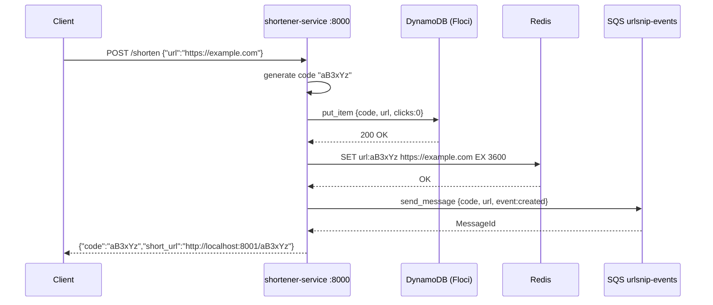
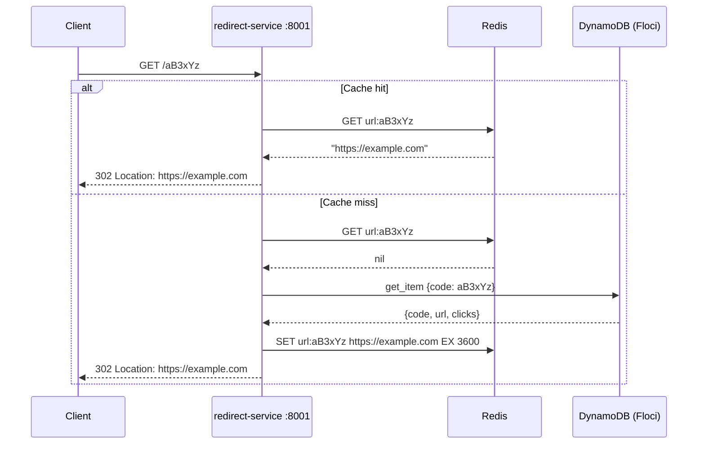
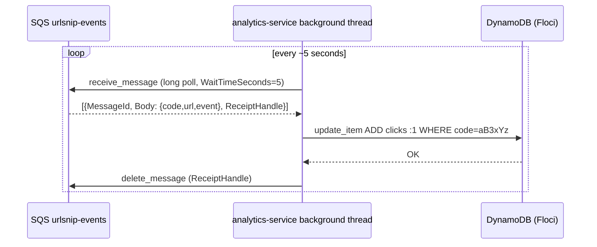

# Data flow

## Flow 1 — POST /shorten (creating a short link)

**Entry point:** Client sends `POST http://localhost:8000/shorten` with `{"url": "https://example.com"}`

Step by step:

1. FastAPI receives the request, validates the body against the `ShortenRequest` Pydantic model
2. `generate_code()` picks 6 random chars from `[a-zA-Z0-9]`
3. boto3 calls DynamoDB `put_item` — writes `{code, url, clicks: 0}` to the `urlsnip` table in Floci
4. Redis client calls `SET url:{code} {url} EX 3600` — warms the cache with a 1-hour TTL
5. If `SQS_QUEUE_URL` is set, boto3 calls `send_message` on the `urlsnip-events` queue with body `{"code": "...", "url": "...", "event": "created"}`
6. Response: `{"code": "aB3xYz", "short_url": "http://localhost:8001/aB3xYz"}`

---

## Flow 2 — GET /:code (following a short link)

**Entry point:** Client sends `GET http://localhost:8001/aB3xYz`

**Cache hit path (fast path):**

1. FastAPI routes to `redirect(code="aB3xYz")`
2. Redis client calls `GET url:aB3xYz`
3. Redis returns the URL
4. Service returns HTTP 302 with `Location: https://example.com`
5. Client browser follows the redirect

**Cache miss path (cold start or TTL expired):**

1. Redis returns `None`
2. boto3 calls DynamoDB `get_item(Key={"code": "aB3xYz"})`
3. If no item: raise `HTTPException(404)`
4. If found: `SET url:aB3xYz {url} EX 3600` — re-warm the cache
5. Return HTTP 302

---

## Flow 3 — Analytics update (async click tracking)

**Background process:** The analytics-service background thread runs continuously, polling SQS every 5 seconds.

Step by step:

1. `sqs.receive_message(QueueUrl=..., MaxNumberOfMessages=10, WaitTimeSeconds=5)` — long poll
2. For each message in the batch:
   a. Parse the JSON body: `{"code": "aB3xYz", "url": "...", "event": "created"}`
   b. Extract `code`
   c. Call `dynamodb.Table.update_item` with `UpdateExpression="ADD clicks :inc"` and `:inc = 1`
   d. Call `sqs.delete_message` with the `ReceiptHandle` to acknowledge the message
3. Loop repeats

Note: the SQS message was originally published by shortener-service on link creation, not on redirect. The analytics currently tracks link creation events, not redirect hits. The `clicks` counter increments once per shortened URL created. To track actual redirects, you would publish a separate event from the redirect service.

---

## Flow 4 — GET /stats/:code

**Entry point:** Client sends `GET http://localhost:8002/stats/aB3xYz`

1. boto3 calls `get_item(Key={"code": "aB3xYz"})` on the `urlsnip` table
2. If not found: 404
3. Returns `{"code": "aB3xYz", "url": "https://example.com", "clicks": 14}`

This is a direct DynamoDB read — no Redis caching on the analytics side.
