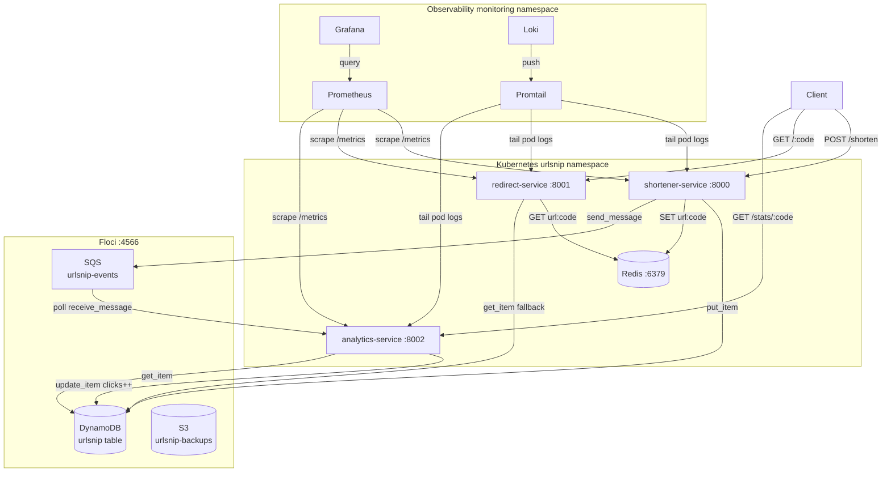

# Architecture overview

## What the system does

urlsnip turns long URLs into short codes. Three independent FastAPI services cover the three distinct concerns: creating short links, resolving them, and counting clicks. Each service has a single job and communicates with the others only through shared storage or async messaging — never with direct HTTP calls between services.

## Services

| Service | Port | Responsibility |
|---|---|---|
| shortener-service | 8000 | Accepts a long URL, generates a 6-character alphanumeric code, writes to DynamoDB, warms the Redis cache, publishes a `created` event to SQS |
| redirect-service | 8001 | Accepts a short code, checks Redis first, falls back to DynamoDB, returns a 302 redirect |
| analytics-service | 8002 | Polls SQS in a background thread, increments click counters in DynamoDB, exposes stats endpoints |

## Communication model

- **Shortener → redirect** — no direct call. Both read the same DynamoDB table and Redis keyspace.
- **Shortener → analytics** — async via SQS. The shortener publishes a JSON message to the `urlsnip-events` queue. The analytics service polls that queue in a background daemon thread.
- **All services → DynamoDB** — synchronous boto3 calls to Floci at `http://172.21.0.2:4566` (inside k8s) or `http://localhost:4566` (in Docker Compose).
- **Shortener + redirect → Redis** — synchronous reads/writes. Redis is `redis-service.urlsnip.svc.cluster.local:6379` in Kubernetes, `redis:6379` in Docker Compose.

## Full system diagram

## Why three services?

The redirect path is the hot path — it will receive an order of magnitude more traffic than the shortener. Separating it means you can scale the redirect deployment to 10 replicas without scaling the shortener at all. The analytics service is intentionally isolated on the slow path: if SQS processing lags, redirects still work perfectly.

## Storage boundaries

Each service only touches the DynamoDB table and Redis. There is no service-to-service HTTP call in the codebase. This means:

- Any service can be restarted without affecting the others mid-request
- The redirect service has no runtime dependency on the shortener service being healthy
- The analytics service can be taken down for maintenance without losing data (messages queue up in SQS)
